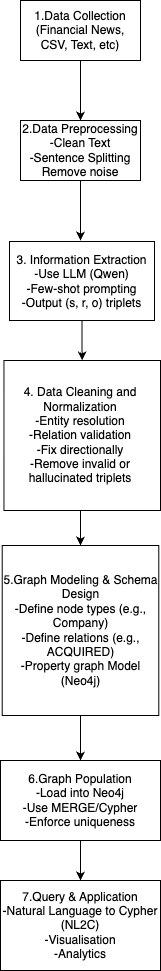
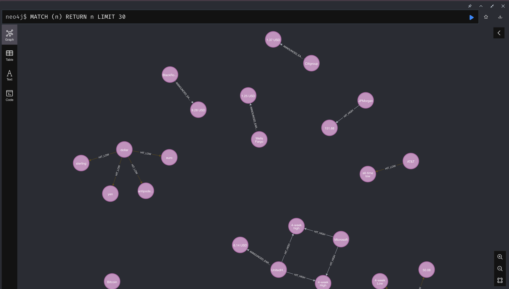
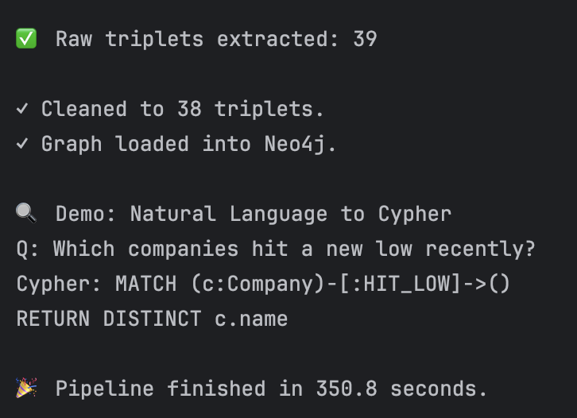
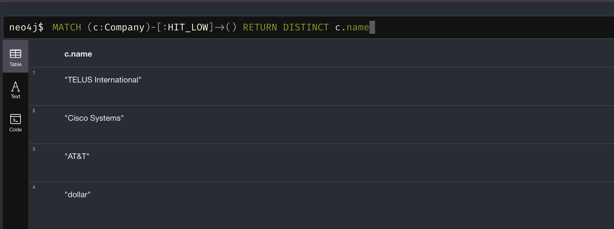
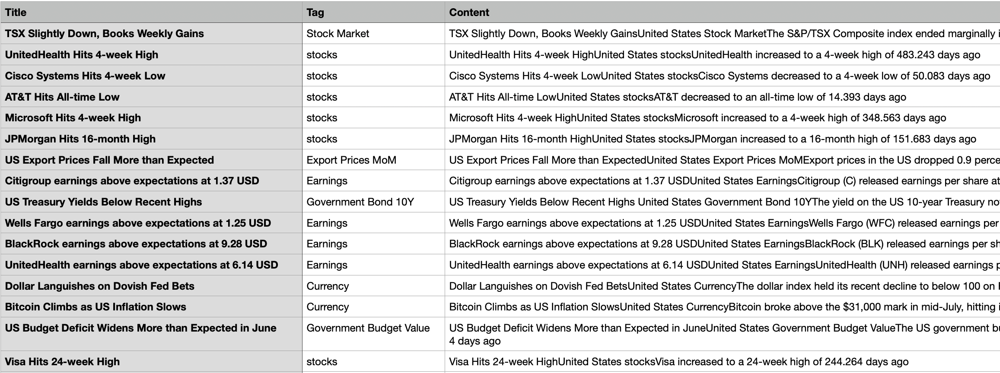

# Financial News Knowledge Graph

End-to-end pipeline that turns unstructured financial news into a queryable **Neo4j knowledge graph**. An LLM extracts entity–relation triplets (acquisitions, investments, founders, earnings announcements, stock highs/lows) from article text, and a natural-language-to-Cypher interface lets you query the graph in plain English.

**Tech stack:** Python · Neo4j · Cypher · OpenRouter (LLM API) · pandas · NLTK



## How it works

1. **Preprocessing** – reads articles from a CSV, cleans the text (trailing timestamps, stray symbols) and splits it into sentences with `nltk`.
2. **Triplet extraction** – few-shot prompts an LLM through the OpenRouter API to return structured JSON triplets. Supported relations: `ACQUIRED`, `INVESTED_IN`, `FOUNDED`, `ANNOUNCED_EARNINGS`, `HIT_HIGH`, `HIT_LOW`.
3. **Validation** – drops LLM outputs that break the expected schema or have an empty subject/object.
4. **Graph loading** – connects to Neo4j, creates uniqueness constraints for `Company` and `Person` nodes, and writes the clean triplets as nodes and relationships.
5. **Natural language → Cypher (demo)** – converts a question such as *"Which companies hit a new low recently?"* into an executable Cypher query.

## Graph schema

- **Nodes:** `Company`, `Person`
- **Relationships:** `ACQUIRED`, `INVESTED_IN`, `FOUNDED`, `ANNOUNCED_EARNINGS`, `HIT_HIGH`, `HIT_LOW`

## Results

<!-- TODO: add real numbers, e.g. articles processed, sentences, valid triplets, nodes and edges in the graph -->

### Graph overview


### Example relationship queries




## Project structure

```
.
├── Financial_news/
│   ├── kg_pipeline.py     # main pipeline script
│   └── Financial.csv      # dataset (not included, see below)
├── docs/                  # diagrams and screenshots
├── requirements.txt
└── README.md
```

## Getting started

### Prerequisites

- Python 3.8+
- A running Neo4j instance (default: `bolt://localhost:7687`)
- An [OpenRouter](https://openrouter.ai) API key

Quick Neo4j setup with Docker:

```bash
docker run -p 7474:7474 -p 7687:7687 -e NEO4J_AUTH=neo4j/your_password neo4j:5
```

### Installation

```bash
git clone https://github.com/nurseit14/Knowledge-graph-pipeline.git
cd Knowledge-graph-pipeline
pip install -r requirements.txt
```

### Configuration

Credentials are read from environment variables, so no secrets live in the code:

```bash
export NEO4J_URI="bolt://localhost:7687"
export NEO4J_USER="neo4j"
export NEO4J_PASSWORD="your_password"
export LLM_API_KEY="your_openrouter_key"
```

### Data

The dataset is not included in the repository because of its size. Place `Financial.csv` in the `Financial_news/` folder.

<!-- TODO: add the dataset source / download link and the expected columns (e.g. title, article text) -->

### Run

```bash
cd Financial_news
python kg_pipeline.py
```

Then open Neo4j Browser at `http://localhost:7474` to explore the graph.

## Limitations

- Extraction quality depends on the LLM and the prompt; some triplets may be missed or wrong.
- Only six relation types are supported.
- The natural-language-to-Cypher step is a demo and does not validate queries before running them.
